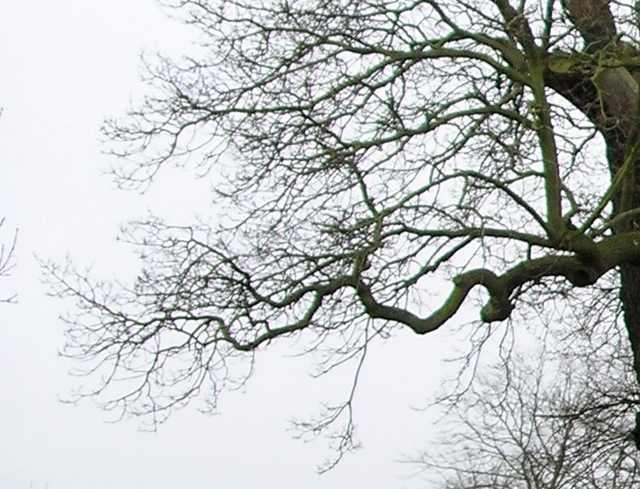

.. include:: <s5defs.txt>

=======================================
Computación Gráfica: Presentación Final
=======================================

:Tema:      Modelado de árboles
:Autores:	Pablo Antonio <pabloa@gmail.com>,
            Marta Ponzoni <martaponzoni@gmail.com>
:Fecha:		15-08-2009
:Copyright:	GNU GPL
:Abstract:	Documento de apoyo para la presentación final de la materia
            Computación Gráfica de la FCEyN de la UBA.

.. footer:: FCEyN - 2009

.. contents:: Tabla de contenidos
   :class: handout

Árboles (I)
===========

.. image:: tree1.jpg
    :scale: 100
    :align: center

Árboles (II)
============

.. image:: tree2.jpg
    :scale: 100
    :align: center

Árboles (II prima)
==================

Árboles (III)
=============

.. image:: tree3.jpg
    :scale: 100
    :align: center

Árboles (IV)
============

.. image:: tree4.jpg
    :scale: 100
    :align: center

Características morfológicas de los árboles 
===========================================

* Simetría
    .. class:: handout

            Blah.

* Afinamiento progresivo de las ramas
    .. class:: handout

        La estructura del árbol contiene su historia

* Apertura de las ramas propia de cada árbol
    .. class:: handout

        En la estructura del árbol se encuentra impresa la intención de...
        Fototropismo

* Diversos tamaños, formas y colores
    .. class:: handout

        Condicionados por el medio ambiente...

* *Self-similarity*
    .. class:: handout

        Observando a los árboles, uno podría decir que, a grandes rasgos,
        presentan esta propiedad, que puede definirse como: La propiedad que
        posee una cierta forma o figura geométrica cuando una parte de esta
        es geométricamente similar a toda la forma o figura.

.. * Fin de las ramas en distintos niveles del árbol

.. * "all the branches of a tree at every stage of its height when put together
  are equal in thickness to the trunk below them"

¿A qué apuntamos?
=================

* Árboles...

    * realistas
        .. class:: handout

            Que se parezcan a árboles...

    * simples
        .. class:: handout

            Nos abstrajimos de los detalles que no eran necesarios para
            que el árbol se viera bien. El punto de corte lo puso el realismo.

    * genéricos
        .. class:: handout

            No pertenecen a una especie en particular.

¿Cómo lo hicimos?
=================

* Diferenciamos: Ramas primarias, secundarias y terciarias.

* Parametrizamos:

    * Tamaño
    * Radio inferior
    * Afinamiento
    * Cantidad de bifurcaciones
    * Ángulo de apertura

¿Cómo lo implementamos? (I)
===========================

* Representación del árbol: Grafo de escena

    * Cada nodo está compuesto por:
        * una transformación 
        * un objeto: un tronco o una hoja

    * Los hijos de un nodo representan los troncos u hojas que penden de él

¿Cómo lo implementamos? (II)
============================

* Construcción del árbol:

    * Sistemas de reescritura:
        * Construcción de Koch
            .. class:: handout

                Reemplazo de un polígono por otro. Hay un iniciador y un
                generador.

        * Sistemas L
            .. class:: handout

                Trabajan sobre strings. Se diferencian de las gramáticas de
                Chomsky porque aplican las producciones en paralelo.

            * Determinísticos - No determinísticos
            * Paramétricos - No paramétricos
            * Estocásticos - No estocásticos

¿Cómo lo implementamos? (III)
=============================

    * Nuestra implementación:
        * Sistema L no determinístico, paramétrico, estocástico

        * (Mostrar PDF/PS adjunto.)

        *h*: Altura del árbol

        *n*: Nivel actual

Extensiones posibles
====================

* Posibilitar la elección de una o varias texturas para las hojas y/o el tronco
    .. class:: handout

        No pertenecen a una especie en particular.

* Agregado de un editor de NURBS para el diseño de las hojas y troncos
    .. class:: handout

        No pertenecen a una especie en particular.

* Templates (sets de datos) para diferentes especies
    .. class:: handout

        No pertenecen a una especie en particular.

¡Fin!
=====

Muchas gracias :)

